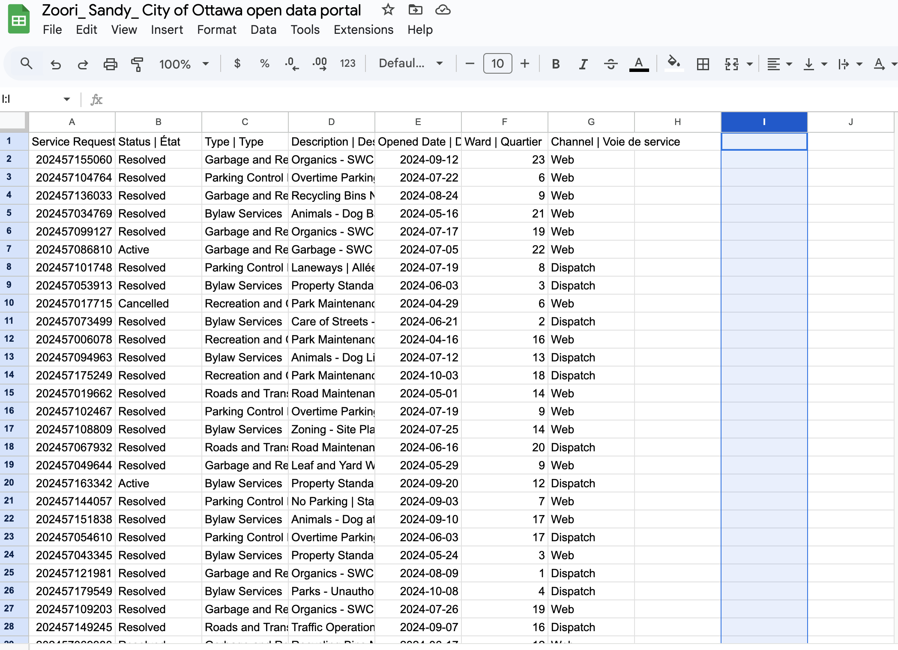
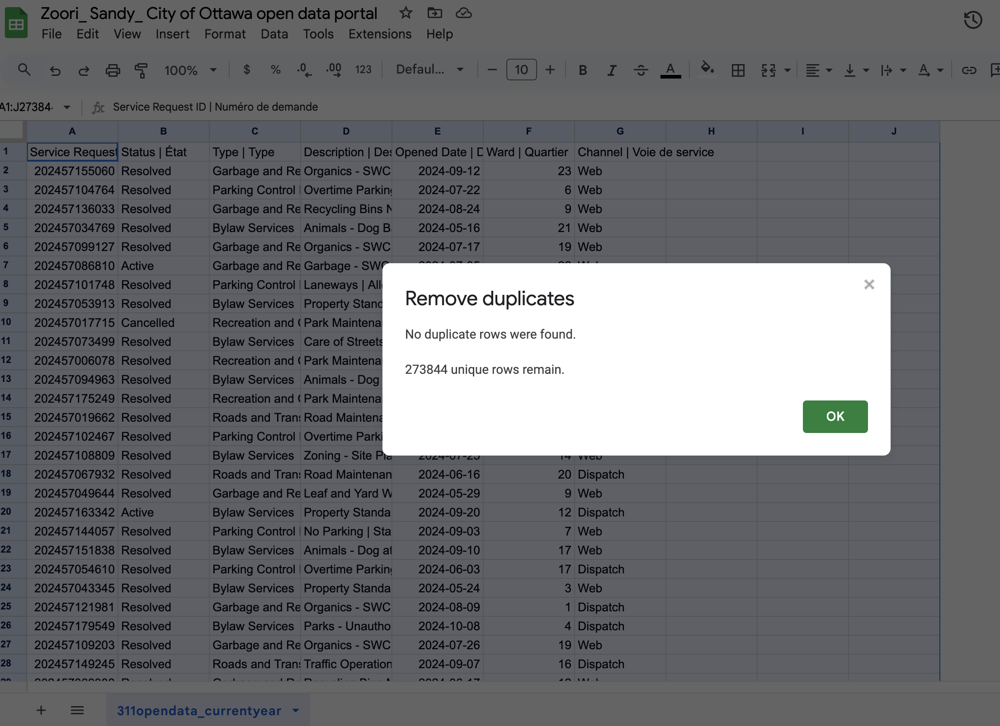
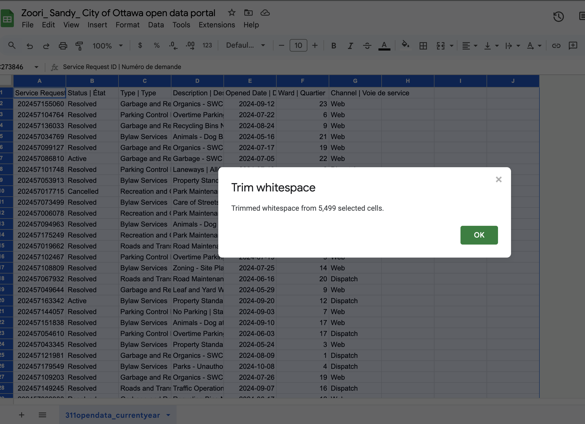
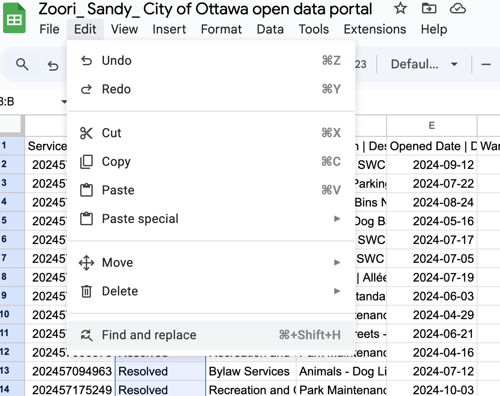
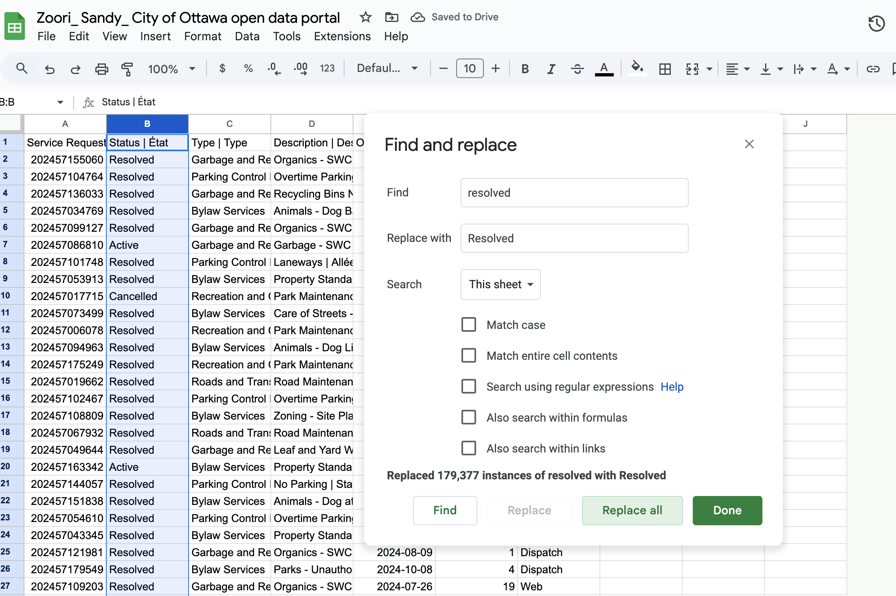
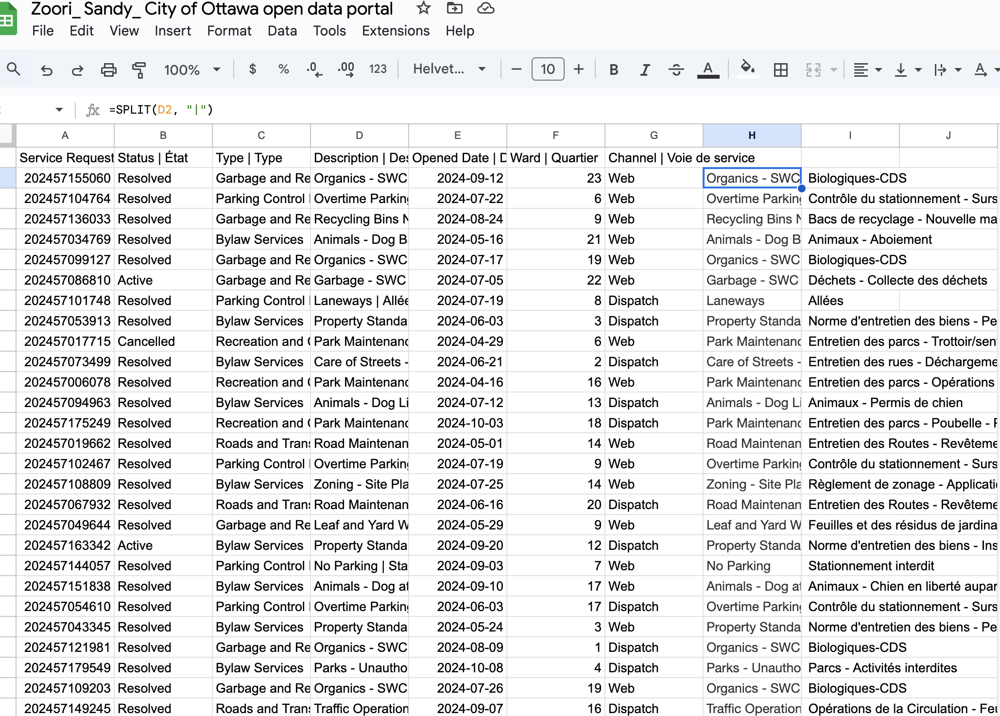
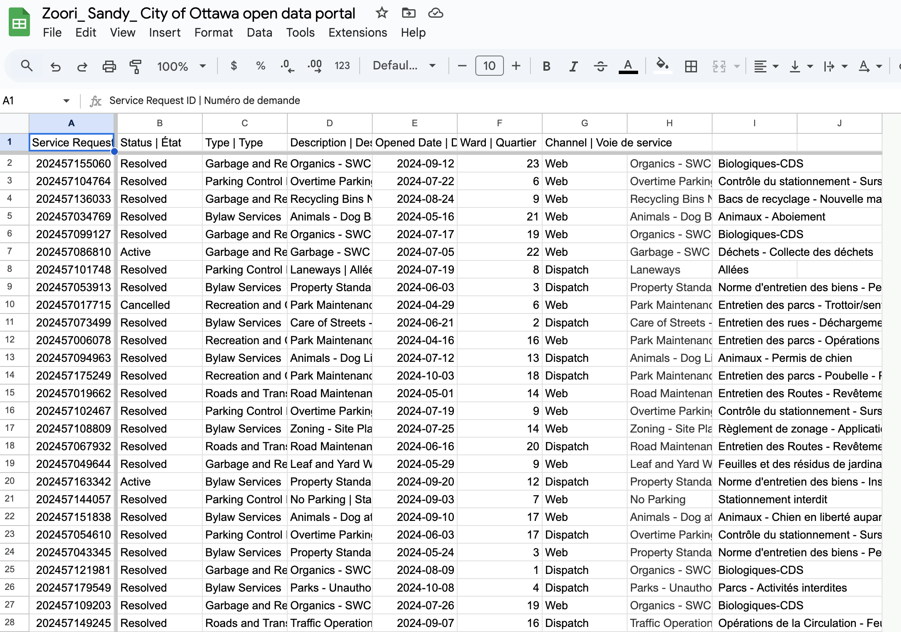
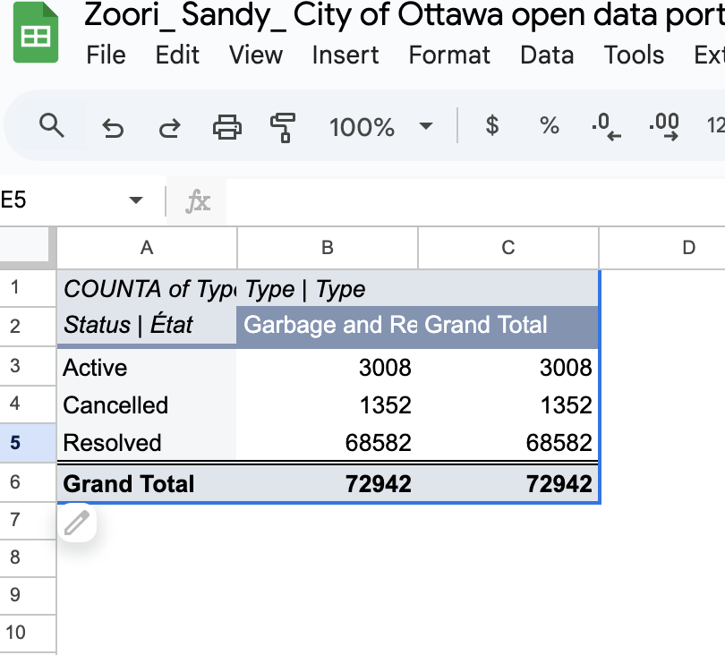

October 18th, 2024
2003A Introductory Data Storytelling
Sandy Zoori
Jean Sebastien Marier

# Midterm Project: Exploratory Data Analysis (EDA)

Analysis of City of Ottawa Dataset on Garbage and Recycling Service Requests

## Foreword

This assignment explores the analysis of a dataset from the City of Ottawa, aiming to uncover insights and narratives that reflect the community's dynamics. By examining the data, I hope to highlight important trends and patterns that can inform decision-making and contribute to a better understanding of urban life in Ottawa. Through this analytical journey, I aim to enhance my skills in data storytelling and provide a clearer picture of the factors influencing our city.

## 1. Introduction

In this assignment, I will be analyzing a dataset from the City of Ottawa, focusing specifically on service requests related to garbage and recycling issues during the month of August 2024. The dataset includes information on various service request types, such as missed garbage pick-up, overfull recycling bins, and street cleanliness concerns. Additionally, it records the geographical location of each request, as well as the dates and times these requests were submitted. The data was collected through the City of Ottawa’s public service reporting system, which allows residents to file complaints and requests regarding waste management issues.
This dataset was updated on October 3, 2024, and it forms part of a broader set of service requests made throughout the year. The purpose of this analysis is to clean and explore the data in order to uncover patterns, trends, and potential areas for improvement in the city’s waste management system. By analyzing the frequency and distribution of these requests, I hope to gain insights into the nature of waste management issues across Ottawa’s neighborhoods, especially during peak months like summer.
The report will be divided into several sections: first, I will describe how I imported the data into Google Sheets and conducted an initial review; second, I will perform a detailed VIMO (Verifiability, Integrity, Methodology, Objectivity) analysis to evaluate the quality of the dataset; third, I will outline the steps taken to clean the data; and lastly, I will conduct an exploratory data analysis (EDA) to visualize trends and insights from the cleaned data.

## 2. Getting Data

To begin the analysis, I downloaded the dataset from the City of Ottawa’s open data portal, which provides a comprehensive list of service requests filed by residents in Ottawa. The dataset was made available as a CSV file. Below is a step-by-step guide for importing the dataset into Google Sheets:
Download the Dataset:
Visit the City of Ottawa Open Data Portal and download the "2024 Service Requests" dataset in CSV format. Once downloaded, save the file on your computer.
Open Google Sheets:
Launch Google Sheets and create a new blank spreadsheet by clicking on "Blank Spreadsheet".
Import the Dataset:
Click on File > Import.
Select the Upload tab, then click Select a file from your device and choose the downloaded CSV file.
Ensure that the separator type is set to Comma, which is the delimiter used in the CSV file.
Select Replace spreadsheet to replace the current empty sheet with the imported data.
 

Review the Imported Data:
Once the data was imported, I saw that the first row had the column headers, and the data included 11 columns in total. Here’s a quick breakdown:
A: Service request
B: Status
C: Type
D: Description
E: Opened Date
F: Closed Date
G: Address
H: Latitude
I: Longitude
J: Ward
k: Channel

There are 273,844 rows in the dataset, so it's pretty big. Here’s what I noticed after importing the data:
Status: Most of the requests are marked as "Resolved," but there are also a lot of "Active" and "Canceled" statuses.
Description: There’s a lot of repetition in the description column, with things like "Garbage and Recycling," "Parking Control," and "Bylaw Services." Since I’m focusing on garbage and recycling, I’ll need to filter out the other stuff.
Address, Latitude, and Longitude: There are a lot of \N values in these columns, which means missing data. I’ll have to decide how to handle those.
Channel: A lot of requests come from "Walk-In" and "Voice-In," and some come from "Data-In." This tells us how people submitted their service requests.
Public Link: You can access my Google Sheets spreadsheet here:
[View Dataset on Google Sheets](https://docs.google.com/spreadsheets/d/1hEZoNEO9x-FGYbgmq1yIWkGZqscOg1qWe9miY8Ox4As/edit?gid=123553105#gid=123553105)

## 3. Understanding Data

### 3.1. VIMO Analysis

Status Column (e.g., Resolved, Active, Cancelled)
Verifiability:
The "Status" column seems fine. It mostly has "Resolved," "Active," and "Cancelled," which are logical. But I need to double-check if "Active" really means the issue is still open or if it’s just an outdated status.
Integrity:
There aren’t any missing values in this column. But, some of the "Active" statuses might be outdated, and I’m not sure if all the "Resolved" ones mean the issue was completely fixed.
Reliability:
It’s generally reliable for understanding how many requests are still open vs. completed, but I’ll need to dive deeper to see if the "Active" ones are truly active.
Type Column (e.g., Garbage and Recycling, Bylaw Services)
Verifiability:
The "Type" column has categories like "Garbage and Recycling," "Parking Control," and "Bylaw Services." Since I'm only looking at garbage and recycling, I’ll need to filter out the irrelevant categories.
Integrity:
The "Type" column has some unrelated categories, so I’ll clean those out to make sure the analysis only includes garbage and recycling requests.
Can we rely on it for trends? (Reliability):
Once I filter out the irrelevant categories, it’ll be reliable for tracking garbage and recycling requests.
Description Column (e.g., Description of Request)
Verifiability:
The "Description" column is a bit repetitive with a lot of entries like "Garbage and Recycling," "Parking Control," and "Bylaw Services." I’ll need to clean this up and focus only on the garbage and recycling descriptions.
Integrity:
The descriptions are mostly accurate, but again, I’ll need to remove the ones related to parking and bylaws.
Reliability:
Once I clean up the column and keep only the garbage and recycling-related descriptions, it’ll be great for identifying trends.
Channel Column (e.g., Walk-In, Voice-In, Data-In)
Verifiability:
The "Channel" column tells us how the requests came in (e.g., "Walk-In," "Voice-In," "Data-In"). This is useful but not essential for the core analysis.
Is the data complete and accurate? (Integrity):
The data seems pretty accurate, but there are a lot of "Walk-In" and "Voice-In" channels. Some "Data-In" entries might need more explanation to understand exactly how they were submitted.
Reliability:
This column is good for understanding how people submitted their requests, but it won’t be the main focus of my analysis.

### 3.2. Cleaning Data

Here’s how I cleaned the data to make it ready for analysis:

Step 1: Removed Unnecessary Columns
I didn’t need some columns in my dataset, like:
Address
Latitude
Longitude
Closed Date
I just deleted these columns because I’m only focusing on the Status, Type, and Open Date columns for my analysis. This helped clean up the sheet and made it easier to work with.

 

Step 2: Removed Duplicates
I checked to see if there were any duplicate rows (meaning the same data repeated). I did this by selecting the data and using the Remove Duplicates tool in Google Sheets. There weren’t any duplicates, but it was a good check to make sure the data wasn’t repeating itself.

 

Step 3: Trimmed Whitespace
Sometimes there are extra spaces before or after the text in the cells, which could mess up sorting or filtering. So, I used Google Sheets' Trim Whitespace feature to clean up any extra spaces in the Columns.
To do this, I selected all the columns by left clicking on the white box, went to Data, and clicked on Data cleanup > Trim Whitespace. This cleaned up the spaces that I couldn’t see but could cause problems when analyzing the data.

  

Step 4: Standardized Text (Find and Replace)
There were some inconsistencies in the Status column. For example, "resolved" was sometimes written as "Resolved" with an uppercase letter, and "cancelled" was written in different ways. To fix this, I used the Find and Replace tool to make everything uniform.
I found all instances of "resolved" and changed them to "Resolved", "active" to "Active", and "cancelled" to "Cancelled". This made sure the text was consistent, which is important for sorting and analysis.

  
   

Step 5: Split Columns (SPLIT function)
Some of the data in the Type column had both English and French descriptions, separated by a "|". To make this easier to work with, I used the SPLIT function to separate the English and French descriptions into two columns.
I used this formula in a new column:
=SPLIT(D2, "|")

   

This split the text at each pipe symbol ("|"), creating two separate columns with the English and French text.

Step 6: Freezing Rows and Columns
To make it easier to navigate my big dataset, I froze the first row (the column headers) and the first column (for the service request numbers). This way, when I scroll down or across the sheet, I can always see the headers and the row numbers.
I did this by going to View > Freeze > 1 row and 1 column.

   
### 3.3. Exploratory Data Analysis (EDA)

For this analysis, I created a pivot table to see how service requests related to garbage and recycling are doing in Ottawa. I looked at three main categories: Active, Cancelled, and Resolved requests. Here's what I found:

**Pivot Table Summary:**

Active Requests: There are 3,008 active requests for both Garbage and Recycling. These are requests that are still open and haven't been completed yet.
Cancelled Requests: There are 1,352 cancelled requests, meaning either the issue was fixed before the service was completed, or the request was removed for some reason.
Resolved Requests: Most of the requests (68,582) have been resolved, showing that a large portion of the service requests have been taken care of.
Grand Total: The total number of requests for both Garbage and Recycling combined is 72,942.

**Here is my Pivot table:**

 
*Figure 2: This pivot table shows...*

**This section should also include a screen capture of your exploratory chart, like so:**

 
*Figure 3: This exploratory chart shows...*

## 4. Potential Story

Looking at the garbage and recycling service requests in Ottawa for August 2024, it seems like the city has some issues with missed garbage pick-ups and overfilled recycling bins. A lot of these problems happen in certain neighborhoods, which could mean that the city's waste collection system needs to be adjusted, especially in busy areas where there are more people.
To dig deeper into this story, I’d want to find out more about the areas where these complaints are happening. Are they in neighborhoods with higher population density? Are these issues happening more often during the summer months, when people are at home more and generating more waste?
It would also be helpful to talk to people working in Ottawa’s waste management, like city workers or public services staff, to get their take on why these issues are happening. Residents could also give useful feedback, so I’d consider reaching out to them through surveys or social media.
Additionally, looking into how other cities handle waste collection during peak months could give some ideas on how Ottawa can improve. A few articles or studies on waste management systems in other cities might provide some good context.
By learning more about these issues, we can better understand how to improve Ottawa’s waste management system.

## 5. Conclusion

This assignment gave me a chance to dive deep into analyzing real-world data, focusing on Ottawa’s garbage and recycling service requests. I started by cleaning the data, which was probably the most time-consuming part of the process. With so many rows and different columns, I had to use multiple methods in Google Sheets, such as removing empty spaces, fixing errors, and splitting combined data into separate columns. This part was challenging because there were a lot of inconsistencies, and I had to make sure everything was properly organized before moving on to the analysis.
The most rewarding part of the project was creating the pivot table and the chart to explore trends and patterns in the data. Seeing how certain neighborhoods had more complaints than others helped me visualize the problem better and sparked ideas for potential solutions.
One gap I realized is that I could have included more advanced data-cleaning techniques, like using OpenRefine for clustering, to streamline the process. Also, I could have looked deeper into the geographical side of things to see if location has a bigger impact on the number of complaints. If I could do this project again, I’d explore using more advanced tools like OpenRefine and try to gather more context about the data sources. Overall, it was a great learning experience, and I now feel more confident with data analysis and storytelling.

## 6. References

Include a list of your references here. Please follow [APA guidelines for references](https://apastyle.apa.org/style-grammar-guidelines/references). Hanging paragraphs aren't required though.

**Here's an example:**

Bounegru, L., & Gray, J. (Eds.). (2021). *The Data Journalism Handbook 2: Towards A Critical Data Practice*. Amsterdam University Press. [https://ocul-crl.primo.exlibrisgroup.com/permalink/01OCUL_CRL/hgdufh/alma991022890087305153](https://ocul-crl.primo.exlibrisgroup.com/permalink/01OCUL_CRL/hgdufh/alma991022890087305153)
